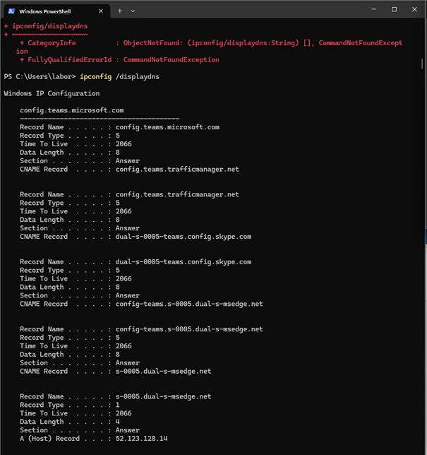
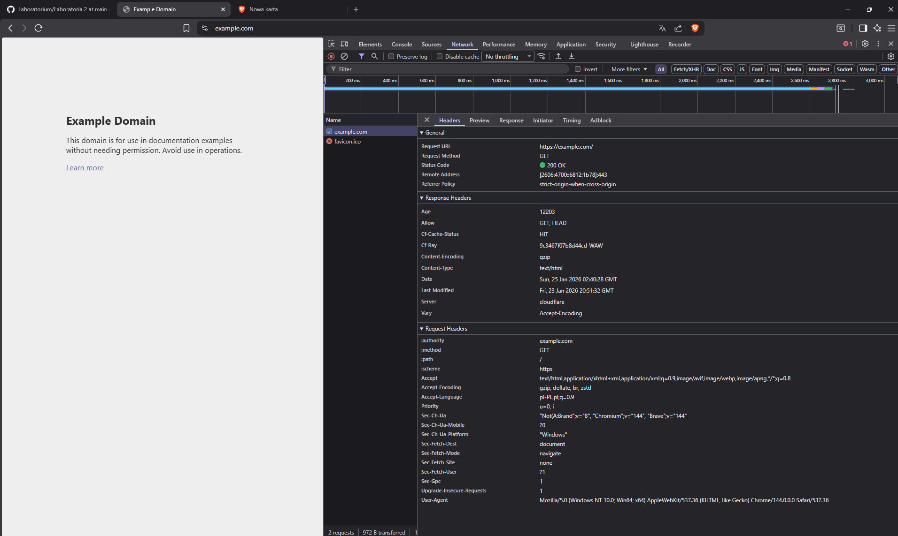
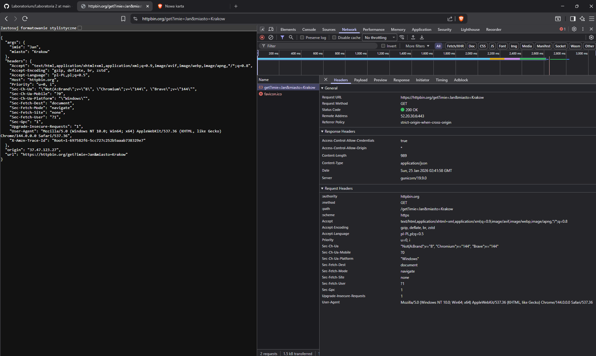
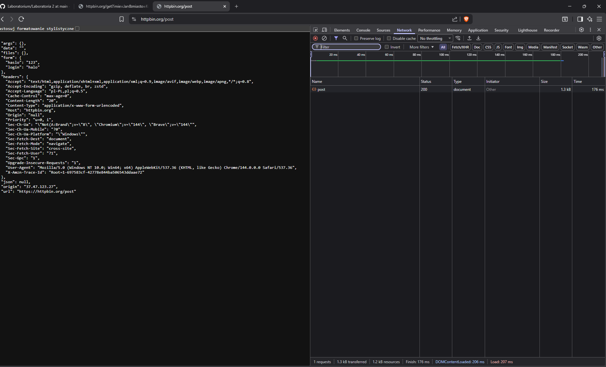

# Zad 1

Wielkość = 2GB
Przepustowość = 56Kb/s

2GB = 2 * 1024 MB = 2048 MB = 2 048 000 KB 
56 Kb/s = 56 000 b/s = 7 000 B/s = 7 KB/s
t = 2 048 000 KB / 7 KB/s = 292 571 s = 292 571 / 3600 h = 81,27 h
t + 1% (narzuty) = 82,08 h

Wynik: Teoretyczny czas potrzebny do pobrania pliku wraz z narzutami wyniesie 82,08h czyli prawie 3 i pół dnia. 

# Zad 2 

T586B
1 - 3
2 - 6
3 - 1
4 - 7
5 - 8
6 -2 
7 - 4
8 - 5

# Zad 3

1. **Czym jest DNS**?
DNS to system który tłumaczy nazwy adresowe (np. google.com) na adresy IP (np. 142.250.74.206). Dzięki temu użytkownik nie musi wpisywać sam adresów IP w przeglądarce, żeby odwiedzić stronę wystarczy tylko znać adres słowny (lub użyć wyszukiwarki).
2. **Dlaczego komputer przechowuje odwiedzone adresy**?
Zachowywanie pamięci DNS pozwala na szybsze ładowanie często odwiedzanych stron, przeglądarka może używać cache DNS, żeby np. sugerować daną stronę w pasku wyszukiwania zanim użytkownik wpiszę cały adres. 

# Zad 4

> Zobacz pliki zad4.xml, zad4.dtd, zad4.xsd, "xml validate.png"

# Zad 5
## Strona html + css (pliki osobno)

# Zad 6

## Odpowiedzi na pytania
1. Parametry w metodzie GET znajdują się w adresie URL po znaku "?"
2. Parametry nien są szyfrowane (widoczne w URL), dopiero HTTPS je szyfruje
3. GET przesyła dane w URL, a POST w body żądania HTTP

